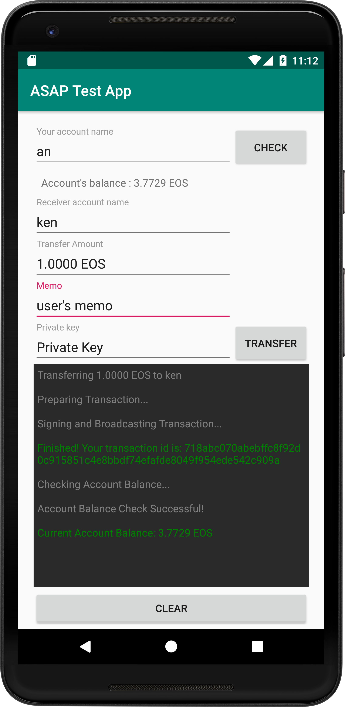

# EOSIO SDK for Java: Android Example App 
[](/./LICENSE)


The EOSIO SDK for Java: Android Example App is a simple application demonstrating how to integrate with EOSIO-based blockchains using [EOSIO SDK for Java](https://github.com/EOSIO/eosio-java). The application does two things: fetches your account token balance and pushes a transfer action.

*All product and company names are trademarks™ or registered® trademarks of their respective holders. Use of them does not imply any affiliation with or endorsement by them.*

<p align="center">
    
</p>

## Contents

- [Requirements](#requirements)
- [Installation](#installation)
- [About the App](#about-the-app)
- [How to Transact](#how-to-transact)
- [Want to Help?](#want-to-help)
- [License & Legal](#license)

## Requirements

* Android SDK 6.0+
* Android Studio 3.0+
* JDK 1.7

## Installation

To get the example application up and running:

1. Clone this repo: `git clone https://github.com/EOSIO/eosio-java-android-example-app.git`
1. Open the project with Android Studio.
1. Create `gradle.properties` file:

    ```java
    node_url=[your node endpoint URL] //mandatory
    from_account=[your account name] //optional
    to_account=[receiver account] //optional
    from_account_private_key=[your private key] //optional
    amount=[amount to transfer] //optional; e.g., 1.1234 EOS
    memo=[transfer memo] //optional
    ```

    `from_account`, `to_account`, `from_account_private_key`, `amount` and `memo` are optional convenience properties which will prefill the app's form. `node_url` is required.

1. Run the app.

## About the App

The app demonstrates how to:
- use the [Android RPC Provider implementation](https://github.com/EOSIO/eosio-java-android-rpc-provider) to query the chain for an account's token balance,
- get a new transaction from [`TransactionSession`](https://github.com/EOSIO/eosio-java/blob/master/eosiojava/src/main/java/one/block/eosiojava/session/TransactionSession.java),
- create an action and add it to a transaction,
- and sign and broadcast the transaction.

To do this we are using a few libraries and providers, in concert:

* [EOSIO SDK for Java](https://github.com/EOSIO/eosio-java): The core EOSIO SDK for Java library
* [Android RPC Provider](https://github.com/EOSIO/eosio-java-android-rpc-provider): An RPC provider implementation for Android
* [ABIEOS Serialization Provider for Android](https://github.com/EOSIO/eosio-java-android-abieos-serialization-provider): A pluggable serialization provider for EOSIO SDK for Java using ABIEOS (for transaction and action conversion between JSON and binary data representations)
* [Softkey Signature Provider](https://github.com/EOSIO/eosio-java-softkey-signature-provider): An example pluggable signature provider for EOSIO SDK for Java for signing transactions using in-memory keys (not for production use)

## How to Transact

[`TransactionTask.java`](app/src/main/java/one/block/androidexampleapp/TransactionTask.java) contains basic sample code for constructing, signing and broadcasting transactions using the `eosiojava` libraries.

### Set Up Your TransactionSession

First, set up your [`TransactionSession`](https://github.com/EOSIO/eosio-java/blob/master/eosiojava/src/main/java/one/block/eosiojava/session/TransactionSession.java). This is your factory for creating new transactions:

1. Create an instance of the [`AbiEosSerializationProviderImpl`](https://github.com/EOSIO/eosio-java-android-abieos-serialization-provider/blob/develop/eosiojavaabieos/src/main/java/one/block/eosiojavaabieosserializationprovider/AbiEosSerializationProviderImpl.java) serialization provider from the [`eosiojavaandroidabieosserializationprovider`](https://github.com/EOSIO/eosio-java-android-abieos-serialization-provider) library.
1. Create an instance of the [`EosioJavaRpcProviderImpl`](https://github.com/EOSIO/eosio-java-android-rpc-provider/blob/master/eosiojavarpcprovider/src/main/java/one/block/eosiojavarpcprovider/implementations/EosioJavaRpcProviderImpl.java) RPC provider with an input string pointing to a nodeos RPC endpoint.
1. Create an instance of the [`ABIProviderImpl`](https://github.com/EOSIO/eosio-java/blob/master/eosiojava/src/main/java/one/block/eosiojava/implementations/ABIProviderImpl.java) ABI provider, instantiating it with the RPC and serialization provider instances.
1. Create an instance of the [` SoftKeySignatureProviderImpl`](https://github.com/EOSIO/eosio-java-softkey-signature-provider/blob/master/eosiojavasoftkeysignatureprovider/src/main/java/one/block/eosiosoftkeysignatureprovider/SoftKeySignatureProviderImpl.java) signature provider. (This particular implementation is not recommended for production use due to its simplistic management of private keys).
    - Import an EOS private key associated with the sender's account.
1. Create an instance of [`TransactionSession`](https://github.com/EOSIO/eosio-java/blob/master/eosiojava/src/main/java/one/block/eosiojava/session/TransactionSession.java), which is used for spawning [`TransactionProcessor`](https://github.com/EOSIO/eosio-java/blob/master/eosiojava/src/main/java/one/block/eosiojava/session/TransactionProcessor.java)s.

### Create, Sign and Broadcast Transactions

Now you're ready to create transactions using your `TransactionSession`:

1. Create an instance of [`TransactionProcessor`](https://github.com/EOSIO/eosio-java/blob/master/eosiojava/src/main/java/one/block/eosiojava/session/TransactionProcessor.java) from the [`TransactionSession`](https://github.com/EOSIO/eosio-java/blob/master/eosiojava/src/main/java/one/block/eosiojava/session/TransactionSession.java) instance above by calling ` TransactionSession#getTransactionProcessor()` or `TransactionSession#getTransactionProcessor(Transaction)`.
1. Call `TransactionProcessor#prepare(List)` with a list of Actions. The method will serialize the actions, which can always be queried with `Transaction#getActions()`. The transaction now is ready to be signed and broadcast.
1. Call `TransactionProcessor#signAndBroadcast()` to sign the transaction inside [`TransactionProcessor`](https://github.com/EOSIO/eosio-java/blob/master/eosiojava/src/main/java/one/block/eosiojava/session/TransactionProcessor.java) and broadcast it.

For a more comprehensive list of available provider implementations, see [`EOSIO SDK for Java - Provider Interface Architecture`](https://github.com/EOSIO/eosio-java/tree/master#provider-interface-architecture). For more details about the architecture of EOSIO SDK for Java, see [`EOSIO SDK for Java - UML Design`](https://github.com/EOSIO/eosio-java/tree/master/document/uml_design.pdf).

## Want to help?

Interested in improving the example application? That's awesome! Here are some [Contribution Guidelines](./CONTRIBUTING.md) and the [Code of Conduct](./CONTRIBUTING.md#conduct).

If you'd like to contribute to the EOSIO SDK for Java libraries themselves, please see the contribution guidelines on those individual repos.

## License
[MIT licensed](./LICENSE)

## Important

See LICENSE for copyright and license terms.  Block.one makes its contribution on a voluntary basis as a member of the EOSIO community and is not responsible for ensuring the overall performance of the software or any related applications.  We make no representation, warranty, guarantee or undertaking in respect of the software or any related documentation, whether expressed or implied, including but not limited to the warranties or merchantability, fitness for a particular purpose and noninfringement. In no event shall we be liable for any claim, damages or other liability, whether in an action of contract, tort or otherwise, arising from, out of or in connection with the software or documentation or the use or other dealings in the software or documentation.  Any test results or performance figures are indicative and will not reflect performance under all conditions.  Any reference to any third party or third-party product, service or other resource is not an endorsement or recommendation by Block.one.  We are not responsible, and disclaim any and all responsibility and liability, for your use of or reliance on any of these resources. Third-party resources may be updated, changed or terminated at any time, so the information here may be out of date or inaccurate.

Wallets and related components are complex software that require the highest levels of security.  If incorrectly built or used, they may compromise users’ private keys and digital assets. Wallet applications and related components should undergo thorough security evaluations before being used.  Only experienced developers should work with this software.
